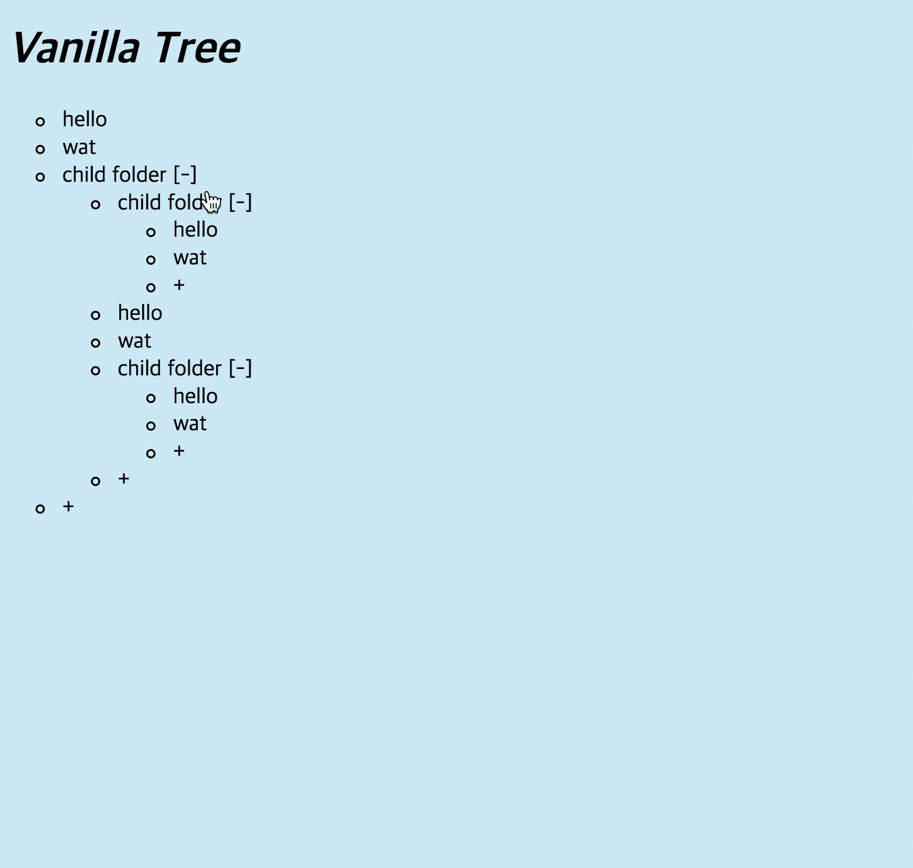

# Tree View

폴더/파일 구조를 HTML5, CSS3, Vanilla Javascript로 표현한 간단한 어플리케이션입니다.



## Setup

Install dependencies

```sh
$ yarn install (or npm install)
```

## Development

```sh
$ yarn dev (or npm run dev)
# visit http://localhost:8080
```

## Features

1. 초기 구동시 기본 구조가 형성되어 있습니다.
2. 각 폴더에는 파일을 생성할 수 있는 버튼이 있습니다.
3. 버튼을 클릭하면 하위 파일이 생성됩니다.
4. 파일을 더블 클릭할 경우, 폴더로 변경됩니다.

## Challenge & Things to do 

- CSS 디자인
- Closure 공부
- 재귀에 대한 이해
